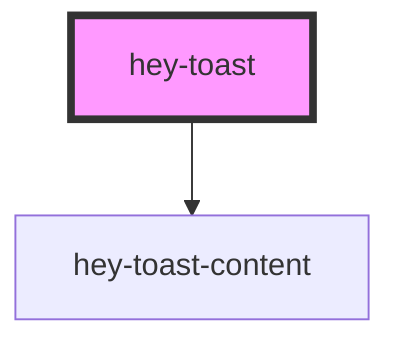

# hey-toast

<!-- Auto Generated Below -->

## Methods

### `Toast(toast: ToastOptions) => Promise<void>`

#### Parameters

| Name    | Type           | Description |
| ------- | -------------- | ----------- |
| `toast` | `ToastOptions` |             |

#### Returns

Type: `Promise<void>`

## Dependencies

### Depends on

- [hey-toast-content](../hey-toast-content)

### Graph

----------------------------------------------

*Built with [StencilJS](https://stenciljs.com/)*
