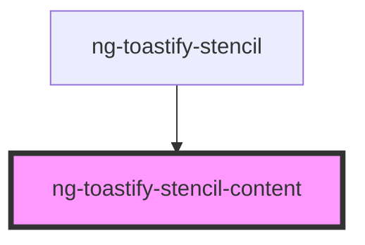

# ng-toastify-stencil-content

<!-- Auto Generated Below -->

## Properties

| Property        | Attribute         | Description | Type      | Default             |
| --------------- | ----------------- | ----------- | --------- | ------------------- |
| `allowClose`    | `allow-close`     |             | `boolean` | `true`              |
| `description`   | `description`     |             | `string`  | `'success message'` |
| `toastTitle`    | `toast-title`     |             | `string`  | `'Success'`         |
| `type`          | `type`            |             | `string`  | `'success'`         |
| `typeBgColor`   | `type-bg-color`   |             | `string`  | `undefined`         |
| `typeIcon`      | `type-icon`       |             | `any`     | `undefined`         |
| `typeTextColor` | `type-text-color` |             | `string`  | `undefined`         |

## Dependencies

### Used by

 - [ng-toastify-stencil](../ng-toastify-stencil)

### Graph

----------------------------------------------

*Built with [StencilJS](https://stenciljs.com/)*
